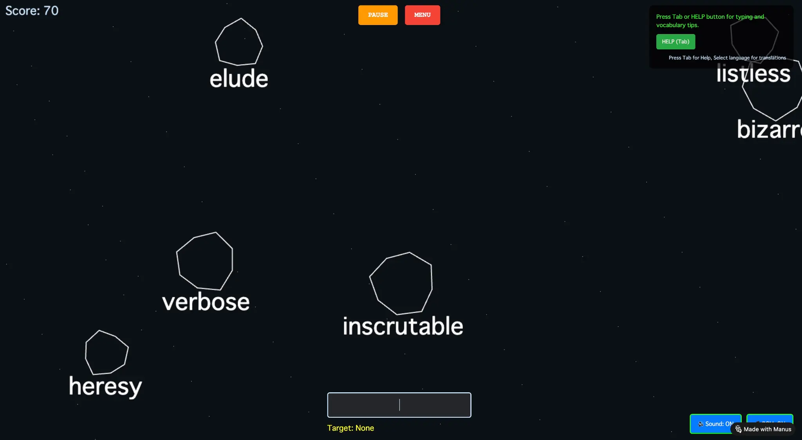

# IELTS Vocabulary Asteroid Game

**IELTS 語彙学習用インタラクティブゲーム**



## 📋 プロジェクト概要

IELTS Vocabulary Asteroid Game は、IELTS 試験対策用の 708 個の英単語を学習するためのインタラクティブなゲームです。隕石が落ちてくる画面で、表示される単語をタイプして破壊するゲームメカニクスを通じて、楽しみながら英単語を学習できます。

### 🎯 主な特徴

- **708 個の IELTS 語彙**: 包括的な IELTS 試験対策単語リスト
- **11 言語対応**: 日本語、スペイン語、中国語、フランス語、イタリア語、韓国語、アラビア語、ヒンディー語、ロシア語、インドネシア語、ポルトガル語
- **インタラクティブゲームプレイ**: Canvas ベースのリアルタイムゲーム
- **音声機能**: テキスト音声変換による単語の発音サポート
- **AI 統合**: Google Gemini API によるゲームティップと励まし
- **ゲーム制御**: 一時停止・再開・メニュー戻る機能

## 🌍 対応言語（11 言語）

| 言語 | コード |
|------|--------|
| 日本語 | ja |
| スペイン語 | es |
| 中国語 | zh |
| フランス語 | fr |
| イタリア語 | it |
| 韓国語 | ko |
| アラビア語 | ar |
| ヒンディー語 | hi |
| ロシア語 | ru |
| インドネシア語 | id |
| ポルトガル語 | pt |

## 🎮 ゲーム画面


**ゲーム実行中の画面**
- スコア表示（左上）
- 一時停止ボタン（⏸ Pause）と メニューボタン（🏠 Menu）が画面中央上部に配置
- 複数の隕石が画面に表示され、各隕石に IELTS 単語が表示
- 画面下部に入力フィールドと現在のターゲット表示
- 右上に AI ティップパネル
- 右下に音声制御ボタン

## ✨ 実装済み機能

### ゲームプレイ
- ✅ 708 個の IELTS 単語
- ✅ リアルタイムゲーム更新
- ✅ スコアシステム
- ✅ 難易度調整（隕石速度・数）
- ✅ 単語の視覚的フィードバック

### 言語・翻訳
- ✅ 11 言語の完全翻訳
- ✅ 言語選択ドロップダウン
- ✅ リアルタイム翻訳表示
- ✅ テキスト音声変換（TTS）

### ゲーム制御
- ✅ ⏸ 一時停止ボタン
- ✅ ▶ 再開ボタン
- ✅ 🏠 メニュー戻るボタン
- ✅ 🔊 音声効果トグル
- ✅ 🎵 BGM トグル

### AI 機能
- ✅ Google Gemini API 統合
- ✅ ゲームティップ提供
- ✅ スコア別励まし
- ✅ リアルタイムアドバイス

### UI/UX
- ✅ レスポンシブデザイン
- ✅ ダークテーマ
- ✅ ホバーエフェクト
- ✅ スムーズなアニメーション

## 📊 技術仕様

### フロントエンド
- **HTML5**: セマンティック マークアップ
- **CSS3**: レスポンシブスタイリング、アニメーション
- **JavaScript ES6+**: ゲームロジック、イベント処理

### バックエンド
- **Python 3.11**: サーバーサイド処理
- **Flask 3.1.1**: Web フレームワーク
- **Flask-SQLAlchemy 3.1.1**: ORM
- **flask-cors 6.0.0**: CORS サポート

### データベース
- **SQLite**: ローカルデータベース

### 外部 API
- **Google Gemini API**: AI ティップ生成
- **Web Speech API**: テキスト音声変換

## 🏗️ アーキテクチャ

```
ielts-asteroid-game/
├── src/
│   ├── main.py                 # Flask アプリケーションエントリーポイント
│   ├── routes/                 # Flask ブループリント
│   │   └── api.py             # API ルート
│   ├── models/                 # データベースモデル
│   │   └── user.py            # ユーザーモデル
│   ├── static/                 # 静的ファイル
│   │   ├── index.html         # メインゲーム UI
│   │   ├── script.js          # ゲームロジック（~500 行）
│   │   ├── style.css          # ゲームスタイル
│   │   ├── ielts_words.js     # 708 個の単語データ
│   │   └── gemini.js          # AI 統合モジュール
│   └── database/
│       └── app.db             # SQLite データベース
├── requirements.txt            # Python 依存関係
├── .gitignore                  # Git 無視ファイル
├── README.md                   # このファイル
└── venv/                       # Python 仮想環境（.gitignore に含まれる）
```

## 🚀 デプロイ方法

### Manus サーバーへのデプロイ

#### 前提条件
- Manus アカウント
- Flask テンプレート対応環境

#### デプロイ手順

1. **リポジトリをクローン**
   ```bash
   git clone https://github.com/Tabibito-AI/ielts-asteroid-game.git
   cd ielts-asteroid-game
   ```

2. **仮想環境を作成**
   ```bash
   python3 -m venv venv
   source venv/bin/activate  # Linux/Mac
   # または
   venv\Scripts\activate  # Windows
   ```

3. **依存関係をインストール**
   ```bash
   pip install -r requirements.txt
   ```

4. **ローカルテスト**
   ```bash
   python src/main.py
   ```
   ブラウザで `http://localhost:5000` にアクセス

5. **Manus にデプロイ**
   - Manus Management UI で新規プロジェクト作成
   - このリポジトリのファイルをアップロード
   - 「Publish」ボタンをクリック

### 環境変数の設定

`.env` ファイルを作成（オプション）：

```env
FLASK_ENV=production
FLASK_DEBUG=False
GEMINI_API_KEY=your_gemini_api_key_here
```

## 📦 依存関係

| パッケージ | バージョン | 用途 |
|-----------|-----------|------|
| Flask | 3.1.1 | Web フレームワーク |
| Flask-SQLAlchemy | 3.1.1 | ORM |
| flask-cors | 6.0.0 | CORS サポート |
| Werkzeug | 3.0.1 | WSGI ユーティリティ |

詳細は `requirements.txt` を参照してください。

## 🎮 ゲームの遊び方

### 基本操作

1. **ゲーム開始**
   - 「Start Game」ボタンをクリック

2. **言語選択**
   - ドロップダウンから希望の言語を選択
   - 翻訳がその言語で表示されます

3. **単語入力**
   - 隕石に表示される単語をタイプ
   - 正しい文字を入力すると隕石が黄色に変わる
   - 単語を完成させると隕石が破壊される

4. **スコア獲得**
   - 単語の長さに応じてスコアを獲得
   - 例：5 文字の単語 = 50 点

5. **ゲーム制御**
   - **⏸ Pause**: ゲームを一時停止
   - **▶ Resume**: ゲームを再開
   - **🏠 Menu**: メニューに戻る

6. **その他の機能**
   - **🔊 Sound**: 効果音のオン/オフ
   - **🎵 BGM**: BGM のオン/オフ
   - **Tab / HELP**: ゲームティップを表示

## 📈 スコアシステム

| 単語長 | スコア |
|--------|--------|
| 4 文字 | 40 点 |
| 5 文字 | 50 点 |
| 6 文字 | 60 点 |
| 7 文字 | 70 点 |
| 8 文字以上 | 80+ 点 |

## 🔧 カスタマイズ

### 単語リストの変更

`src/static/ielts_words.js` を編集：

```javascript
const ieltsWords = [
    "Word1",
    "Word2",
    "Word3",
    // ...
];
```

### ゲーム難易度の調整

`src/static/script.js` で以下を修正：

```javascript
// 隕石の速度
this.speed = 0.5 + Math.random() * 1.5;  // 値を増加させると難易度上昇

// 隕石の最大数
if (gameRunning && asteroids.length < 8) {  // 8 を変更
```

### スタイルのカスタマイズ

`src/static/style.css` で色やサイズを変更

## 🐛 トラブルシューティング

### ゲームが起動しない
- ブラウザのコンソール（F12）でエラーを確認
- `ielts_words.js` が正しく読み込まれているか確認

### 翻訳が表示されない
- 言語選択ドロップダウンで言語を選択
- `wordTranslations` オブジェクトが正しく定義されているか確認

### AI ティップが表示されない
- Gemini API キーが正しく設定されているか確認
- ネットワーク接続を確認

## 📝 ライセンス

MIT License - 詳細は LICENSE ファイルを参照

## 👥 貢献

プルリクエストを歓迎します。大きな変更の場合は、まずイシューを開いて変更内容を議論してください。

## 📞 サポート

問題が発生した場合は、GitHub Issues で報告してください。

## 🔗 リンク

- **デプロイ URL**: https://ieltsgame-joucpohc.manus.space/
- **GitHub リポジトリ**: https://github.com/Tabibito-AI/ielts-asteroid-game

## 📅 更新履歴

### v1.0.0 (2025-11-03)
- ✅ 初版リリース
- ✅ 708 個の IELTS 単語
- ✅ 11 言語対応
- ✅ ゲーム制御機能（一時停止・メニュー戻る）
- ✅ AI 統合
- ✅ 音声機能

---

**作成日**: 2025 年 11 月 3 日  
**最終更新**: 2025 年 11 月 3 日  
**バージョン**: 1.0.0

Made by Tabibito AI

